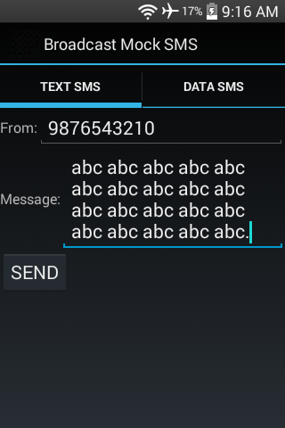
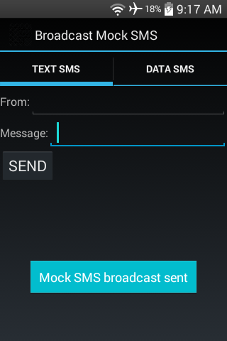
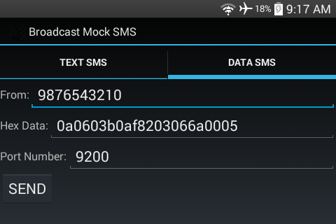

#### [Broadcast Mock SMS](https://github.com/warren-bank/Android-Broadcast-Mock-SMS)

Android app that broadcasts a mock SMS to mimic receiving a new text/data message.

#### Overview:

* this is a tool useful to Android developers
  * helps to test broadcast receivers that monitor and respond to inbound SMS messages

#### Screenshot:





#### Notes:

* minimum supported version of Android:
  * Android 1.0 (API 1)
* maximum supported version of Android:
  * Android 5.1 (API 22)
* [will __not__ work](https://commonsware.com/blog/2013/10/06/secured-broadcasts-sms-clients.html) when a broadcast receiver requires a signature-level permission that is defined by the Android platform
  * for example:
    ```xml
      <receiver
          android:name=".SmsReceiver"
          android:permission="android.permission.BROADCAST_SMS">
          <intent-filter>
              <action android:name="android.provider.Telephony.SMS_RECEIVED" />
          </intent-filter>
      </receiver>
    ```
  * `android.permission.BROADCAST_SMS` is a signature-level permission
    * this permission is defined by the Android platform
    * only apps signed with the same key as the firmware can acquire this permission
  * `SmsReceiver` is a broadcast receiver that only receives Intents broadcast from apps that have acquired this permission
    * neither this app, nor any other 3rd party apps, can satisfy this filter criteria
  * suggestion:
    * during development, remove `android:permission="android.permission.BROADCAST_SMS"` to allow testing with mock SMS broadcasts
    * add it back for release builds

#### Legal:

* copyright: [Warren Bank](https://github.com/warren-bank)
* license: [GPL-2.0](https://www.gnu.org/licenses/old-licenses/gpl-2.0.txt)
