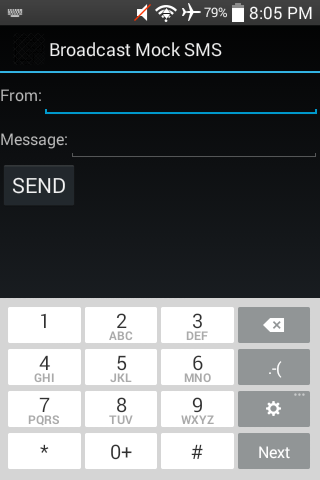
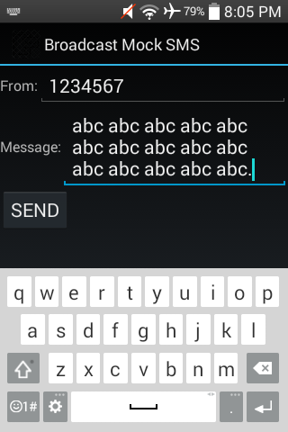
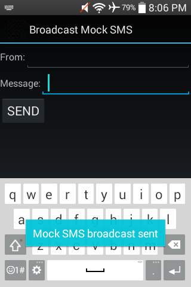

#### [Broadcast Mock SMS](https://github.com/warren-bank/Android-Broadcast-Mock-SMS)

Android app that broadcasts a mock SMS to mimic receiving a new text message.

#### Overview:

* this is a tool useful to Android developers
  * helps to test broadcast receivers that monitor and respond to inbound SMS messages

#### Screenshot:

#### Notes:

* minimum supported version of Android:
  * Android 1.1 (API 2)
* according to [this discussion](https://stackoverflow.com/questions/16143186/can-i-send-sms-received-intent-in-android-4-1-2), beginning with Android 4.1.2 JB, this code will only work when run as a system app
  * root is required
  * [Link2SD](https://play.google.com/store/apps/details?id=com.buak.Link2SD) is a free app that automates converting an app between user and system (as well as lots of other useful things)

#### Caveats:

* YMMV
  * it may work on some devices, but not others
  * on the test device that I happen to be using during development:
    * the `SMS_RECEIVED` Intent:
      * at first, it wasn't getting broadcast
      * I noticed in logcat that another app was throwing a Security Exception
      * after I froze "Visual Voicemail", it started working
    * the `SmsReceiverService`:
      * doesn't exist
      * _TO DO:_ figure out why..

#### Credits:

* [this article](https://web.archive.org/web/20120818021045/http://blog.dev001.net/post/14085892020/android-generate-incoming-sms-from-within-your-app) provides the critical code to make this work
* [this blog post](https://roshandawrani.wordpress.com/2014/06/10/android-simulating-sms-receiving-from-any-number/) uses the same code, but does a nice job adding some finishing touches

#### Legal:

* copyright: [Warren Bank](https://github.com/warren-bank)
* license: [GPL-2.0](https://www.gnu.org/licenses/old-licenses/gpl-2.0.txt)
